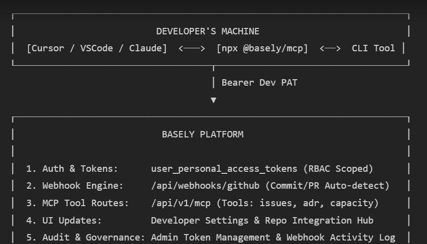

# Product Requirements Document (PRD) & Technical Specification
## Basely Developer Ecosystem: MCP Server, User Scoped PATs, CLI & GitHub Auto-Sync

---

### 1. Executive Summary & Vision

This initiative expands Basely from a browser-based project management platform into an **AI-native Developer Operating System**. 

By introducing **User-Scoped Personal Access Tokens (Dev PATs)**, an **Official Basely Model Context Protocol (MCP) Server**, a **Zero-Install Developer CLI**, and **Bi-directional GitHub Webhook Automation**, developers can interact with Basely directly from their IDEs (Cursor, VS Code, Claude Desktop, Antigravity IDE) and command-line terminals without needing browser access or administrator privileges.

---

### 2. Core Problem & Solution

#### The Non-Admin Dilemma
* **Problem**: Basely's existing `api_keys` table is organization-scoped and restricted to `Admin` roles. Individual developers cannot generate keys to connect their local tools, and granting every developer Org Admin access violates least-privilege security.
* **Solution**: Introduce **User-Scoped Developer Personal Access Tokens (Dev PATs)**.
  - Bound directly to `user_id` (not just `organization_id`).
  - Inherits the user's granular Row-Level Security (RLS) and project permissions.
  - Non-admin developers can self-serve tokens restricted strictly to their assigned work.
  - Org Admins retain centralized governance (can enable/disable dev tokens org-wide, configure max token TTL, and revoke any token immediately).

#### The Context-Switching Problem
* **Problem**: Developers dislike leaving their IDEs and terminal to manually update issue statuses, check sprint backlogs, or log blockers.
* **Solution**:
  - **Basely MCP Server**: Exposes Basely tools directly to local AI assistants in Cursor, Windsurf, Claude, and Antigravity.
  - **GitHub Webhook Engine**: Automatically detects branch pushes, PR openings, reviews, and merges on GitHub, updating the corresponding Basely issues in real time.
  - **Basely CLI**: Instant terminal access to assigned tasks, sprint goals, and status changes.

---

### 3. User Stories

1. **As a Developer**:
   - I want to generate a personal token from my user profile without asking my organization admin, so that I can connect my IDE and terminal tools immediately.
   - I want my IDE's AI assistant to fetch my assigned issues, ADRs, and requirements via MCP, so that I don't have to copy-paste context from the browser.
   - I want Basely to automatically move my assigned issue to *In Review* when I open a PR, and *Done* when the PR merges, without manual status updates.
   - I want to run `npx @basely/cli issues list` in my terminal to see what I should work on next.

2. **As an Organization Admin / Security Lead**:
   - I want full visibility over all active developer tokens created across the organization, so that I can monitor access and revoke compromised credentials instantly.
   - I want to enforce expiration limits (e.g. 30/90 days) and restrict token capabilities to non-sensitive scopes.

3. **As a Project Manager**:
   - I want real-time accuracy on sprint progress derived from actual GitHub activity, eliminating stale task statuses caused by delayed manual entry.

---

### 4. System Architecture

```
┌─────────────────────────────────────────────────────────────────────────────┐
│                             DEVELOPER ENVIRONMENT                           │
│                                                                             │
│   ┌────────────────────────────────┐     ┌──────────────────────────────┐   │
│   │    AI IDEs / MCP Clients       │     │     Terminal CLI             │   │
│   │  (Cursor, Claude, Antigravity) │     │   (npx @basely/cli)          │   │
│   └───────────────┬────────────────┘     └──────────────┬───────────────┘   │
└───────────────────┼─────────────────────────────────────┼───────────────────┘
                    │ stdio / SSE                         │ HTTPS REST
                    ▼                                     ▼
┌─────────────────────────────────────────────────────────────────────────────┐
│                      BASELY MCP SERVER (@basely/mcp)                        │
│                                                                             │
│   Tools:                                                                    │
│   • list_my_issues           • get_project_context      • create_blocker    │
│   • update_issue_status      • get_active_adrs          • log_work_done     │
└──────────────────────────────────────┬──────────────────────────────────────┘
                                       │ Bearer Dev PAT (User Scoped)
                                       ▼
┌─────────────────────────────────────────────────────────────────────────────┐
│                               BASELY PLATFORM                               │
│                                                                             │
│  ┌───────────────────────┐  ┌──────────────────────┐  ┌──────────────────┐  │
│  │ User PAT Auth & RLS   │  │ /api/v1/mcp Engine   │  │ /api/webhooks/   │  │
│  │ Middleware            │  │ (Tool Execution)     │  │ github (Events)  │  │
│  └───────────────────────┘  └──────────────────────┘  └────────▲─────────┘  │
│                                                                │            │
│  ┌──────────────────────────────────────────────────────────┐  │            │
│  │ Supabase PostgreSQL DB:                                  │  │            │
│  │ • user_personal_access_tokens  • github_issue_links      │  │            │
│  │ • github_repository_mappings   • issues / backlog_items  │  │            │
│  └──────────────────────────────────────────────────────────┘  │            │
└────────────────────────────────────────────────────────────────┼────────────┘
                                                                 │ Webhook
                                                    ┌────────────┴────────────┐
                                                    │   GITHUB REPOSITORY     │
                                                    │  (Push / PRs / Merges)  │
                                                    └─────────────────────────┘
```

---

### 5. Functional Modules & Specifications

#### Module 1: Developer Access Module (User-Scoped PATs)
* **Token Format**: `basely_pat_<random_32_chars>` (SHA-256 hashed before database storage).
* **Scopes**:
  - `issues:read` — View issues/backlog items assigned to the user or within accessible projects.
  - `issues:write` — Update status, assignees, estimates, and comments.
  - `context:read` — Read project ADRs, PRDs, sprint goals, and roadmap phases.
  - `risks:write` — Escalate blockers or register RAID risk items.
* **Self-Serve UI**: Available at `Account Settings > Developer Settings > Personal Access Tokens`.
* **One-Click Config**: Generates ready-to-paste `mcp_config.json` snippet with prefilled credentials.

#### Module 2: Official Basely MCP Server (`@basely/mcp`)
Distributed as a zero-install npm package executed via `npx -y @basely/mcp` using stdio transport.

##### Supported MCP Tools:
1. `basely_list_assigned_issues`:
   - Returns issues, bugs, and backlog items assigned to the authenticated user.
   - Parameters: `status` (optional: `open`, `in_progress`, `closed`), `limit` (default: 20).
2. `basely_get_issue_details`:
   - Returns detailed description, acceptance criteria, linked PRDs, and comments for an issue.
   - Parameters: `issue_key` (e.g., `BAS-102`).
3. `basely_update_issue_status`:
   - Transitions an issue (e.g. `to_do` -> `in_progress` -> `in_review` -> `done`).
   - Parameters: `issue_key`, `status`, `comment` (optional).
4. `basely_get_active_adrs`:
   - Fetches accepted Architecture Decision Records to ensure IDE code conforms to team standards.
   - Parameters: `project_id` or `project_slug`.
5. `basely_create_blocker`:
   - Creates a blocker entry in the project's RAID log directly from the developer's chat.
   - Parameters: `issue_key`, `title`, `impact_description`, `severity`.
6. `basely_get_developer_capacity`:
   - Returns remaining sprint capacity for the developer to assist AI in scoping tasks.

#### Module 3: GitHub Webhook Automation Engine (`/api/webhooks/github`)
* **Security**: Validates incoming payload using `X-Hub-Signature-256` HMAC-SHA256 signature.
* **Repository Mapping**: Links a GitHub repo (`owner/repo`) to a specific Basely project.
* **Smart Pattern Matching**:
  - Extracts issue keys matching `[A-Z]{2,10}-\d+` (e.g. `BAS-104`) from:
    1. Git Branch Name (`feat/BAS-104-auth-tokens` -> links branch).
    2. Commit Message (`git commit -m "Fixes BAS-104: add token hash table"`).
    3. PR Title & Body (`Resolves BAS-104`, `Closes BAS-104`).
* **Automated Status State Machine**:
  - `Branch Created` -> Issue status moves to `In Progress` (auto-assigns developer if unassigned).
  - `PR Opened` -> Issue moves to `In Review`, attaches PR link and author to Basely issue card.
  - `PR Review Approved` -> Issue tagged with `Review Passed`.
  - `PR Merged` -> Issue automatically transitions to `Done`, sets completion timestamp, and notifies team.

#### Module 4: Inbound MCP (Basely Platform as MCP Client)
* Allows Basely's internal AI agents to connect to external developer systems.
* Integrations via MCP:
  - **Sentry / Bugsnag MCP**: Automatically pull production stacktraces into newly created Basely bug tickets.
  - **GitHub MCP**: Basely AI can draft PRs or check repository file trees directly from within a PRD or ADR workspace.
  - **Datadog / Cloudwatch MCP**: Correlate deployment milestones with error rate spikes.

#### Module 5: Developer CLI (`@basely/cli`)
A lightweight command-line companion:
```bash
# Authenticate
npx @basely/cli login

# View tasks
npx @basely/cli issues list --mine

# Start work (creates branch and moves issue to In Progress)
npx @basely/cli issues start BAS-102 --branch

# Log blocker
npx @basely/cli blocker add BAS-102 "Waiting for staging DB credentials"
```

---

### 6. Database Schema & Migration Specifications

```sql
-- 1. User Personal Access Tokens (Non-Admin self-serve)
CREATE TABLE IF NOT EXISTS public.user_personal_access_tokens (
    id UUID PRIMARY KEY DEFAULT gen_random_uuid(),
    user_id UUID NOT NULL REFERENCES public.profiles(id) ON DELETE CASCADE,
    organization_id UUID NOT NULL REFERENCES public.organizations(id) ON DELETE CASCADE,
    name TEXT NOT NULL,
    token_prefix TEXT NOT NULL,       -- e.g. "basely_pat_ab12"
    token_hash TEXT NOT NULL UNIQUE,   -- SHA-256 hash
    scopes TEXT[] NOT NULL DEFAULT '{"issues:read", "issues:write", "context:read"}',
    created_at TIMESTAMPTZ NOT NULL DEFAULT NOW(),
    expires_at TIMESTAMPTZ NOT NULL DEFAULT (NOW() + INTERVAL '90 days'),
    revoked_at TIMESTAMPTZ,
    last_used_at TIMESTAMPTZ
);

CREATE INDEX idx_user_pats_user ON public.user_personal_access_tokens(user_id);
CREATE INDEX idx_user_pats_hash ON public.user_personal_access_tokens(token_hash);
ALTER TABLE public.user_personal_access_tokens ENABLE ROW LEVEL SECURITY;

-- Users can manage their own PATs
CREATE POLICY "Users can view own pats" ON public.user_personal_access_tokens
    FOR SELECT USING (auth.uid() = user_id);
CREATE POLICY "Users can create own pats" ON public.user_personal_access_tokens
    FOR INSERT WITH CHECK (auth.uid() = user_id);
CREATE POLICY "Users can revoke own pats" ON public.user_personal_access_tokens
    FOR UPDATE USING (auth.uid() = user_id);

-- Org Admins can view and revoke any member PAT for security audit
CREATE POLICY "Org Admins can audit pats" ON public.user_personal_access_tokens
    FOR SELECT USING (public.get_user_role_in_org(organization_id, auth.uid()) = 'Admin');
CREATE POLICY "Org Admins can revoke member pats" ON public.user_personal_access_tokens
    FOR UPDATE USING (public.get_user_role_in_org(organization_id, auth.uid()) = 'Admin');

-- 2. GitHub Repository Integration Mappings
CREATE TABLE IF NOT EXISTS public.github_repository_mappings (
    id UUID PRIMARY KEY DEFAULT gen_random_uuid(),
    project_id UUID NOT NULL REFERENCES public.projects(id) ON DELETE CASCADE,
    repository_full_name TEXT NOT NULL, -- e.g. "Zanarepo/Basely"
    webhook_secret TEXT NOT NULL,
    auto_link_branches BOOLEAN NOT NULL DEFAULT TRUE,
    auto_transition_issues BOOLEAN NOT NULL DEFAULT TRUE,
    created_at TIMESTAMPTZ NOT NULL DEFAULT NOW(),
    updated_at TIMESTAMPTZ NOT NULL DEFAULT NOW(),
    UNIQUE(project_id, repository_full_name)
);

-- 3. GitHub Issue Links & Sync History
CREATE TABLE IF NOT EXISTS public.github_issue_links (
    id UUID PRIMARY KEY DEFAULT gen_random_uuid(),
    issue_id UUID NOT NULL REFERENCES public.issues(id) ON DELETE CASCADE,
    github_event_type TEXT NOT NULL,    -- 'branch', 'commit', 'pull_request'
    external_reference TEXT NOT NULL,   -- e.g. "PR #42" or "commit 15d5113"
    external_url TEXT,
    author_username TEXT,
    created_at TIMESTAMPTZ NOT NULL DEFAULT NOW()
);
```

---

### 7. Phased Implementation Roadmap

```
[Phase 1: Token Engine & Auth] ──> [Phase 2: MCP Server Core] ──> [Phase 3: GitHub Webhook Sync] ──> [Phase 4: Dev CLI & UI]
```

#### Phase 1: Developer Access Engine (Database & Middleware)
- [ ] Create `user_personal_access_tokens` table and RLS policies.
- [ ] Update `src/lib/api-auth/middleware.ts` to support dual token authentication (`api_keys` for org integrations, `user_personal_access_tokens` for developers).
- [ ] Inject authenticated `userId` into API context for row-level entity queries.
- [ ] Add Organization toggle: "Allow member developer tokens" in organization settings.

#### Phase 2: Basely MCP Server Package
- [ ] Scaffold `@basely/mcp` package with stdio and SSE transport support.
- [ ] Implement core tools: `list_my_issues`, `get_issue_details`, `update_issue_status`, `get_active_adrs`, `create_blocker`.
- [ ] Publish / bundle executable for `npx -y @basely/mcp`.

#### Phase 3: GitHub Webhook & Automation Engine
- [ ] Create endpoint `src/app/api/webhooks/github/route.ts` with HMAC signature verification.
- [ ] Implement regex parser for issue keys across branch names, commits, and PR descriptions.
- [ ] Build automatic issue transition state engine (`open` -> `in_progress` -> `in_review` -> `done`).
- [ ] Record activity in `github_issue_links` and update task comments with PR links.

#### Phase 4: UI & Developer Settings Experience
- [ ] Build **User Developer Settings** (`/settings/developer`):
  - Token creation modal with scope selection.
  - Active tokens list with "Last Used" and "Revoke" actions.
  - Ready-to-copy `mcp_config.json` snippet generator.
- [ ] Build **Project Integrations Page** (`/projects/[id]/settings/integrations/github`):
  - Webhook URL and secret generator.
  - Repository mapping settings & auto-transition toggles.
- [ ] Build **Admin Security Center**:
  - Global overview of all developer PATs across the organization.

#### Phase 5: Developer CLI
- [ ] Package `@basely/cli` with subcommands: `login`, `issues list`, `issues start`, `blocker add`.

---

### 8. Acceptance Criteria

1. **Self-Service Token Creation**: A standard team member with no Admin privileges can successfully generate a personal token with restricted scopes.
2. **RLS Isolation**: A developer token cannot read or mutate projects, financial figures, or issues to which that user has not been granted access.
3. **MCP IDE Integration**: Running the MCP server in Claude Desktop, Cursor, or Antigravity IDE connects successfully and allows the model to query assigned issues and update statuses.
4. **GitHub Auto-Detection**:
   - Pushing a branch named `feature/BAS-101` updates issue `BAS-101` status to `In Progress`.
   - Opening a PR titled `Fixes BAS-101` moves status to `In Review` and embeds the PR URL in the issue.
   - Merging the PR marks `BAS-101` as `Done`.
5. **Admin Governance**: An Organization Admin can view all active member tokens and revoke any token immediately.




#workflow--Ask AI agent to read a commnet in any intellegence doc and organize it based on sentimnets and suggest responses to them- the agents can also be used to respond to those commnets as me doing the responses.

## ask the ai to go thru the PRD, creat epic in a specific ticket in jira or anywhere and breakdown or create stories in the associated epics and assign them to specific teams or people, based on urgence and importance


## Use the Ai agent to write status repoet of the work that has been done within a given period of a certain project