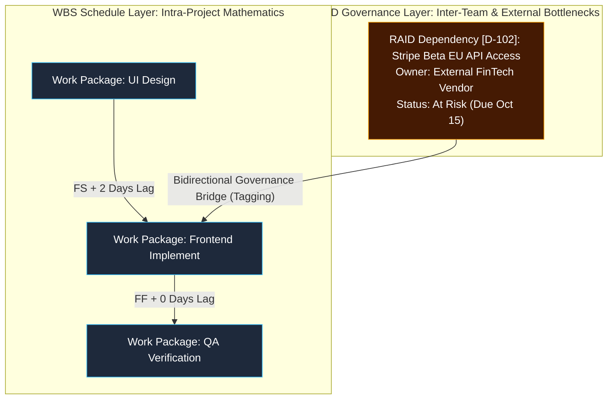

# Product Requirements Document (PRD)
# Sprint 51: Enterprise Delivery Governance — Architecture Decision Records (ADR), Team Capacity & Skills Matrix, and Full RAID Command Center

---

## 1. Objective & Scope

The objective of **Sprint 51** is to elevate Basely from an operational project tracking dashboard into an **Enterprise Software Delivery Engine** by eliminating critical engineering and PMO blind spots. While earlier sprints established product discovery (Personas, OKRs, VoC Logs) and core project execution (WBS, Gantt, EVM), scaling engineering organizations require explicit governance over technical trade-offs, human skill capabilities, and cross-functional dependencies.

This sprint introduces three foundational capabilities:
1. **Architecture / Technical Decision Records (ADRs)**: An immutable historical ledger documenting significant engineering choices, context, trade-offs, and technical debt.
2. **Team Capacity & Skills Matrix**: A dual-dimension resource planner that maps organizational competencies (skills, certifications) and real-time operational bandwidth beyond simple hourly billable rates.
3. **Full RAID Command Center (Risks, Assumptions, Issues, Dependencies)**: Upgrading basic risk registers into an advanced enterprise PMO command center. Crucially, this establishes dedicated governance for **Assumptions** (unverified working beliefs) and **Dependencies** (inter-team, hardware, regulatory, or vendor deliverables outside direct project team control).

By the end of this sprint, delivery teams will be able to:
- Author, review, and link **ADRs** directly to Product Requirements Documents (PRDs) and WBS Work Packages, preventing architectural drift.
- Evaluate team capability using an interactive **Skills Matrix & Capacity Planner**, ensuring sprint goals and work packages are staffed by qualified specialists with available bandwidth.
- Track all four **RAID** domains in a single executive interface with automated validation due dates for Assumptions and visual blocking alerts for external Dependencies.

> **Hard dependency:** Requires Sprint 50 (PRD Studio & Document Engine), Sprint 38 (Document Library Registry), Sprint 16 (Resource Management & Rate Cards), and Sprint 18/41 (Risk Management & Change Request Logs).

---

## 2. Methodology-Aware Architecture (Waterfall, Agile & Hybrid Alignment)

Because Basely natively supports **Waterfall (Predictive)**, **Agile (Adaptive)**, and **Hybrid** methodologies, terminology, target bindings, and user interface workflows must dynamically adapt based on the project's configuration (`project.methodology`).

### 2.1. Methodology Terminology Mapping Table

| Feature Domain | Waterfall (Predictive) Terminology | Agile (Adaptive) Terminology | Universal / Hybrid Terms |
| :--- | :--- | :--- | :--- |
| **RAID Primary Linkage** | **WBS Work Package / Activity / Milestone** | **Epic / Feature / Sprint Goal** | Allows attaching to either a **WBS Element** *or* a **Sprint Backlog Item**. |
| **RAID Dependencies** | **External Predecessor / Phase Gate Blocker** | **Cross-Team Blocker / Release Dependency** | Displays in both the **WBS Side Panel** *and* on **Sprint/Kanban Task Cards** as a *Blocker Badge*. |
| **RAID Assumptions** | **Baseline Planning Assumption** | **Hypothesis / Backlog Experiment** | Governed by structured validation due dates triggered before milestone sign-offs or retrospectives. |
| **Capacity Measurement** | **Available Man-Hours / FTE Allocated** | **Sprint Velocity / Capacity Points** | **Available Bandwidth (%)** (Universal baseline across both models). |
| **Skill & Competency Alignment** | **Role Discipline (e.g., *Lead Database Engineer*)** | **Cross-Functional Tag (e.g., *DevOps Specialist*)** | **Skills Map & Proficiency Rating** (e.g., *React [Expert], AWS [Advanced]*). |
| **ADR Governance Trigger** | Created during **System Architecture / Technical Design Phase** prior to baseline. | Created iteratively during **Sprint Zero / Epic Grooming / Architectural Spikes**. | Tracked in the central document library with lifecycle flags (*Proposed ➔ Accepted ➔ Superseded*). |

### 2.2. Architectural Distinction: WBS Predecessors vs. RAID Dependencies

To prevent conceptual confusion between existing WBS dependency scheduling and RAID external dependencies, the system enforces a strict operational distinction:



1. **WBS Predecessors (Schedule Math)**:
   - **Scope**: Internal tasks within the same project schedule.
   - **Mechanics**: Governed by chronological engineering formulas (`FS`, `SS`, `FF`, `SF` + `Lag Days`). Drives automatic Gantt chart rendering and Critical Path calculations.
2. **RAID Dependencies (External Governance)**:
   - **Scope**: Third-party vendors, regulatory approvals, hardware delivery, or upstream cross-team deliverables outside direct day-to-day schedule control.
   - **Mechanics**: Governed by SLAs, external owner tracking, target commit dates, and confidence ratings. DOES NOT alter EVM math or Gantt lag formulas directly.
3. **The Bidirectional Governance Bridge**:
   - In the RAID Log, PMs tag internal WBS Work Packages that rely on external dependencies.
   - In the **WBS Side Panel**, an amber **RAID Governance Alert Block** dynamically renders underneath mathematical predecessors if an external dependency is unfulfilled or at risk:
     > 🛡️ **Blocked by RAID Dependency [D-102]**: *Stripe Beta EU API Access (Due: Oct 15 — Status: At Risk)*

---

## 3. User Stories

- **As a Software Architect**, I want to document technical design trade-offs in structured Architecture Decision Records (ADRs), so that future engineers understand why specific platforms or patterns were adopted without repeatedly debating solved problems.
- **As an Engineering Manager**, I want to evaluate my team using a capacity and skills matrix, so that I can balance sprint velocity against actual specialist bandwidth and identify single-point-of-failure skill bottlenecks (Bus Factor).
- **As a Project Manager in a Waterfall workspace**, I want to allocate staff by billable man-hours while filtering candidate drop-downs by required specialist proficiencies, ensuring technical compliance for fixed-price contracts.
- **As a Scrum Master in an Agile workspace**, I want to track external cross-team dependencies in a RAID Log and link them directly to Sprint Epics, so that sprint blockers are immediately highlighted during daily stand-ups.
- **As a PMO Director**, I want critical working assumptions logged with mandatory verification due dates, so that unvalidated beliefs can be formally tested before they materialize into project failures.

---

## 4. Technical Architecture & Database Design

### 4.1. Schema Expansions (PostgreSQL)

All new relational tables inherit standard multi-tenant isolation via `organization_id` and strict Row Level Security (RLS).

```sql
-- 1. Architecture Decision Records (ADR) Metadata Table
CREATE TABLE architecture_decision_records (
  id UUID PRIMARY KEY DEFAULT gen_random_uuid(),
  organization_id UUID NOT NULL REFERENCES organizations(id) ON DELETE CASCADE,
  project_id UUID REFERENCES projects(id) ON DELETE CASCADE,
  document_id UUID REFERENCES documents(id) ON DELETE SET NULL, -- Links to doc registry
  title TEXT NOT NULL,
  status TEXT NOT NULL CHECK (status IN ('proposed', 'accepted', 'deprecated', 'superseded', 'rejected')),
  context TEXT NOT NULL,
  decision TEXT NOT NULL,
  consequences TEXT NOT NULL,
  technical_domain TEXT NOT NULL CHECK (technical_domain IN ('backend', 'frontend', 'database', 'infrastructure', 'security', 'ai_data')),
  superseded_by_adr_id UUID REFERENCES architecture_decision_records(id) ON DELETE SET NULL,
  created_by UUID REFERENCES profiles(id),
  created_at TIMESTAMPTZ DEFAULT now(),
  updated_at TIMESTAMPTZ DEFAULT now()
);

-- 2. Team Competency & Skills Profile
CREATE TABLE member_skill_profiles (
  id UUID PRIMARY KEY DEFAULT gen_random_uuid(),
  organization_id UUID NOT NULL REFERENCES organizations(id) ON DELETE CASCADE,
  user_id UUID NOT NULL REFERENCES profiles(id) ON DELETE CASCADE,
  skill_name TEXT NOT NULL, -- e.g., 'React', 'Kubernetes', 'PostgreSQL'
  skill_category TEXT NOT NULL CHECK (skill_category IN ('frontend', 'backend', 'devops', 'data_science', 'design', 'management')),
  proficiency_level TEXT NOT NULL CHECK (proficiency_level IN ('beginner', 'intermediate', 'advanced', 'expert')),
  years_experience NUMERIC(3,1) DEFAULT 1.0,
  is_primary_specialization BOOLEAN DEFAULT false,
  updated_at TIMESTAMPTZ DEFAULT now(),
  UNIQUE(user_id, skill_name)
);

-- 3. Team Capacity & Bandwidth Allocation
CREATE TABLE member_capacity_allocations (
  id UUID PRIMARY KEY DEFAULT gen_random_uuid(),
  organization_id UUID NOT NULL REFERENCES organizations(id) ON DELETE CASCADE,
  project_id UUID NOT NULL REFERENCES projects(id) ON DELETE CASCADE,
  user_id UUID NOT NULL REFERENCES profiles(id) ON DELETE CASCADE,
  iteration_id UUID REFERENCES project_iterations(id) ON DELETE SET NULL, -- Agile linkage
  wbs_phase_id UUID REFERENCES wbs_elements(id) ON DELETE SET NULL, -- Waterfall linkage
  available_hours_per_week NUMERIC(5,2) DEFAULT 40.00,
  allocated_percentage INTEGER DEFAULT 100 CHECK (allocated_percentage BETWEEN 0 AND 100),
  sprint_velocity_points NUMERIC(5,2) DEFAULT 10.00, -- Used in Agile projects
  effective_start_date DATE NOT NULL,
  effective_end_date DATE NOT NULL,
  updated_at TIMESTAMPTZ DEFAULT now()
);

-- 4. Unified RAID Log Table (Extending current risk management)
CREATE TABLE raid_log_entries (
  id UUID PRIMARY KEY DEFAULT gen_random_uuid(),
  organization_id UUID NOT NULL REFERENCES organizations(id) ON DELETE CASCADE,
  project_id UUID NOT NULL REFERENCES projects(id) ON DELETE CASCADE,
  category TEXT NOT NULL CHECK (category IN ('risk', 'assumption', 'issue', 'dependency')),
  title TEXT NOT NULL,
  description TEXT NOT NULL,
  status TEXT NOT NULL CHECK (status IN ('open', 'in_progress', 'mitigated', 'closed', 'verified', 'invalidated')),
  priority TEXT NOT NULL CHECK (priority IN ('low', 'medium', 'high', 'critical')),
  owner_id UUID REFERENCES profiles(id),
  external_owner_name TEXT, -- Used for third-party dependencies
  target_resolution_date DATE,
  validation_due_date DATE, -- Mandatory for 'assumption' category
  impact_rating INTEGER CHECK (impact_rating BETWEEN 1 AND 5),
  probability_rating INTEGER CHECK (probability_rating BETWEEN 1 AND 5),
  mitigation_plan TEXT,
  linked_wbs_element_id UUID REFERENCES wbs_elements(id) ON DELETE SET NULL,
  linked_sprint_item_id UUID REFERENCES feature_backlog_items(id) ON DELETE SET NULL,
  created_by UUID REFERENCES profiles(id),
  created_at TIMESTAMPTZ DEFAULT now(),
  updated_at TIMESTAMPTZ DEFAULT now()
);
```

---

## 5. UI/UX & Component Design

All interfaces in Sprint 51 must strictly adhere to our **Enterprise Design System**: vibrant HSL glassmorphic surfaces (`bg-app-surface`, `border-app-border`), responsive micro-animations, and exclusive use of **`EnterpriseSelect` with React Portals** for all dropdown menus to guarantee clean overlay rendering across modals and complex data tables.

### 5.1. Architecture Decision Records Studio (`/dashboard/projects/adr/`)
- **`AdrWorkspace.tsx`**: A structured directory displaying architectural records filtered by Status and Technical Domain using portal-rendered `EnterpriseSelect` menus.
- **`AdrStudioModal.tsx`**: A distraction-free technical editor with dedicated blocks for *Context*, *Decision*, and *Consequences (Trade-offs)*. Includes an option switcher to formally supersede legacy ADRs.
- **PRD Integration**: Upgrades `PrdMetadataRibbon.tsx` to display linked ADRs right above technical requirements.

### 5.2. Team Capacity & Skills Matrix (`/dashboard/team/capacity/`)
- **`SkillsMatrixTable.tsx`**: A high-density organizational heatmap. Rows represent team members; columns map technical domain proficiencies (`Expert` ➔ Deep Purple Badge, `Intermediate` ➔ Blue Badge).
- **`CapacityPlannerModal.tsx`**: Dynamically toggles input labels based on project methodology:
  - In **Agile** projects: Prompts for *Sprint Velocity (Story Points)* and *Iteration Dates*.
  - In **Waterfall** projects: Prompts for *Available Weekly Man-Hours* and *WBS Phase Assignment*.
- **WBS Resource Picker Enhancement**: When selecting a resource for a task in `ActivityAssignmentSheet.tsx`, the `EnterpriseSelect` dropdown now displays the employee's **Core Skills** and **Available Bandwidth %** directly inside the option subtitle!

### 5.3. Unified RAID Command Center (`/dashboard/risks/` Upgrade)
- **`RaidWorkspace.tsx`**: Transforms the existing dashboard into a 4-pill command module: **[Risks]**, **[Assumptions]**, **[Issues]**, and **[Dependencies]**.
- **`RaidItemModal.tsx`**: An intelligent form that dynamically configures required inputs based on selected category:
  - Choosing **Assumption** reveals a mandatory *Validation Due Date* picker and validation test criteria box.
  - Choosing **Dependency** reveals fields for *External Owner Name*, *Commit Date*, and a bidirectional selector to bind the dependency to an internal WBS Work Package or Agile Epic.
- **WBS Side Panel Integration**: Updates `WbsDependenciesList.tsx` to automatically render an emergency **RAID Governance Alert Badge** when an active Work Package is blocked by an unfulfilled RAID item.

---

## 6. Implementation Task Breakdown: Sprint 51

### Phase 1: Database Schema & Supabase Server Actions
- [ ] **Task 1.1**: Execute migrations to generate `architecture_decision_records`, `member_skill_profiles`, `member_capacity_allocations`, and `raid_log_entries` tables with corresponding RLS policies.
- [ ] **Task 1.2**: Implement backend server actions (`getAdrs`, `saveAdr`, `getTeamSkillsMatrix`, `updateMemberCapacity`, `getRaidItems`, `upsertRaidEntry`).
- [ ] **Task 1.3**: Register `architecture_decision_record` as a native document type in the Document Library registry.

### Phase 2: Architecture Decision Record (ADR) Studio
- [ ] **Task 2.1**: Build `AdrWorkspace.tsx` featuring filterable table listings and quick-preview slide-over panels.
- [ ] **Task 2.2**: Build `AdrStudioModal.tsx` with structured editing blocks for architectural Context, Decision, and Trade-offs using `EnterpriseSelect` for domain categorization.
- [ ] **Task 2.3**: Connect ADR linking capabilities into `PrdMetadataRibbon.tsx` and WBS element detail views.

### Phase 3: Team Capacity & Skills Matrix
- [ ] **Task 3.1**: Build `SkillsMatrixTable.tsx` allowing engineering leaders to filter staff by skill competency levels and certifications.
- [ ] **Task 3.2**: Build `CapacityPlannerModal.tsx` with methodology-aware toggling (Man-Hours for Waterfall vs. Velocity Points for Agile).
- [ ] **Task 3.3**: Upgrade resource assignment dropdowns across the Budget & WBS modules to surface specialist skill tags and real-time bandwidth in `EnterpriseSelect` subtitles.

### Phase 4: RAID Command Center & WBS Governance Bridge
- [ ] **Task 4.1**: Expand the existing Risks & Issues module into the comprehensive `RaidWorkspace.tsx` with unified category filtering.
- [ ] **Task 4.2**: Build `RaidItemModal.tsx` with smart conditional field validation (Assumptions due dates and Dependency external ownership).
- [ ] **Task 4.3**: Integrate the **Bidirectional Governance Bridge** into `WbsDependenciesList.tsx`, rendering live warning badges on WBS tasks when external RAID dependencies fall behind schedule.

---
*End of Sprint 51 PRD. This specification bridges traditional PMO rigor with modern Agile engineering leadership—empowering teams to govern architecture, human talent, and cross-functional dependencies with zero friction.*
